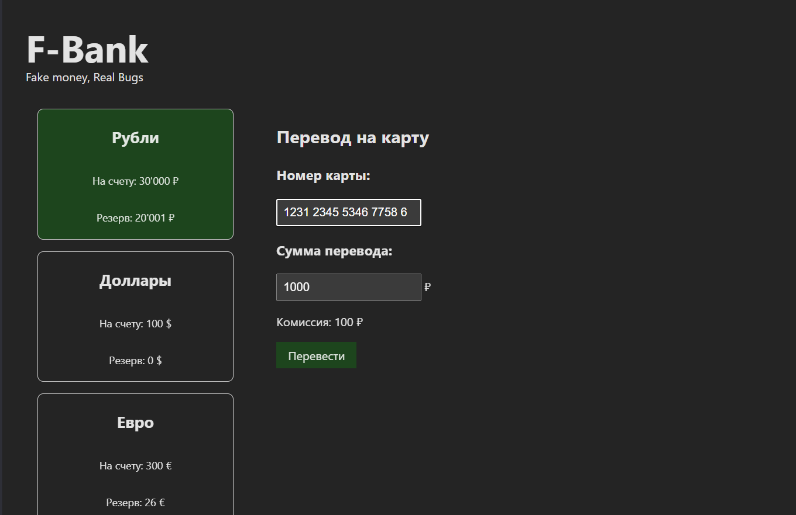

# BUG-001: Возможность успешного перевода при вводе 17 цифр в поле «Номер карты» на странице перевода

- **Серьёзность:** Major
- **Приоритет:** High
- **Окружение:**
  - OS: Ubuntu 24.04 LTS (x86_64)
  - Browser: Google Chrome 136.0.7103.113 (headless)
  - App build: `dist/index.html` (local file URI)

## Предусловие
1. Открыта страница сервиса.
2. Был выбран счет **"Рубли"**.

## Шаги воспроизведения
1. Перейти в форму ввода.
2. Ввести в поле номера значение 35632158965432678.
3. Ввести любую валидную сумму в поле "Сумма перевода".
4. Нажать кнопку "Перевести".
5. Проверить, появился ли блок ввода суммы перевода.

## Фактический результат
Поле "Номер карты" принимает 17 цифр, валидация формы не срабатывает. После нажатия кнопки "Перевести" запускается процесс транзакции (появляется сообщение об успешном переводе / списываются средства).

## Ожидаемый результат
Форма блокирует отправку перевода. Поле "Номер карты" подсвечивается красным цветом, под ним отображается сообщение об ошибке: "Номер карты должен содержать от 13 до 16 цифр". Кнопка "Перевести" неактивна.

## Влияние
Нарушение базовой валидации платёжных реквизитов.

## Скриншот

