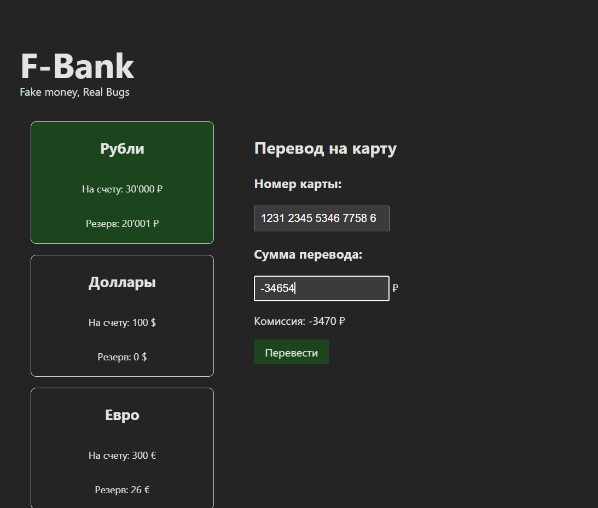

# BUG-002: Возможность проведения транзакции при вводе отрицательного значения в поле "Сумма перевода"

- **Серьёзность:** Critical
- **Приоритет:** Highest
- **Окружение:**
  - OS: Ubuntu 24.04 LTS (x86_64)
  - Browser: Google Chrome 136.0.7103.113 (headless)
  - App build: `dist/index.html` (local file URI)

## Предусловия
1. Открыта страница сервиса.
2. Выбран счет **Рубли**
3. Введет корректный номер карты из 16 цифр в поле "Номер карты".

## Шаги воспроизведения
1. Ввести в поле суммы значение -1000.
2. Нажать кнопку Перевести.

## Ожидаемый результат
Поле "Сумма перевода" не принимает знак минуса (блокирует ввод) ИЛИ при вводе -1000 поле подсвечивается ошибкой "Сумма перевода должна быть больше 0". Кнопка "Перевести" становится неактивной (disabled), отправка формы невозможна.

## Фактический результат
Кнопка Перевести активна. После клика транзакция отправляется в обработку.

## Влияние
Критическая уязвимость бизнес-логики. Риск проведения некорректных финансовых операций (например, несанкционированное зачисление средств на счет отправителя при "отрицательном" списании).

## Скриншот

